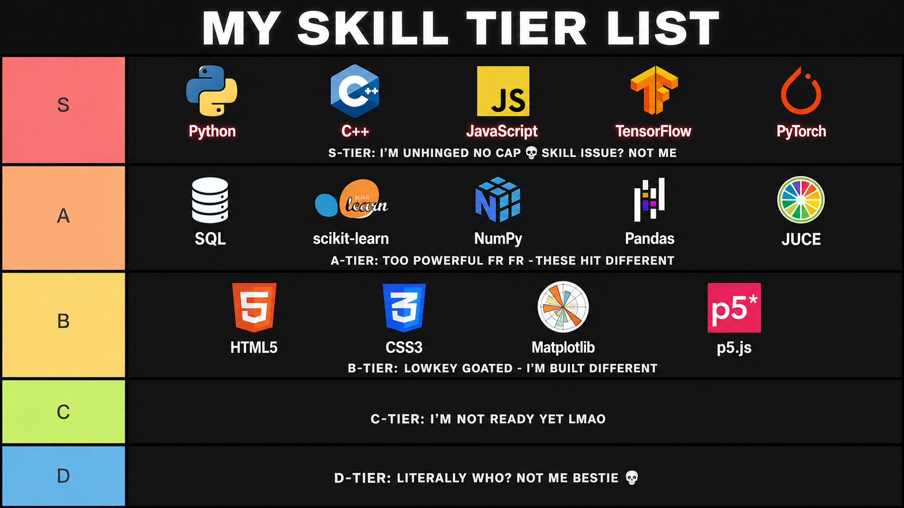

<div align="center">

</div>

<div align="center">

## **≡ RESUME (UNFILTERED) ≡**

</div>

---

<div style="background-color: #0a0e27; border-left: 4px solid #00f0ff; border-right: 4px solid #ff0040; border-radius: 8px; padding: 25px; margin: 20px 0;">

### **WHO I AM**

**AI/ML Engineer** | **Code Terrorist** | **Caffeine-Powered Menace to Society**

Bro I literally teach machines to be smarter than you while you're scrolling TikTok. It's giving God complex energy fr fr. They told me I was dangerous. I said "slay" and kept going. No cap bestie.

---

### **WHAT I DO**

**My Addiction:** Coffee ☕ (it's not even coffee anymore it's just espresso)

**My Religion:** Neural Networks 🧠 (they're my children now)

**Currently Breaking:** Deep Learning • TensorFlow/PyTorch going absolutely CRAZY • NLP (emotions are SCREAMING) • Real-time Audio DSP (it slaps different) • Game Physics (gravity? don't know her) • Intrusion Detection (catching hackers like Pokémon) • Your Expectations • The Laws of Physics • Common Sense

Build it. BREAK IT. Fix it in the most unhinged way possible. Break it AGAIN. Somehow it works??? My code's literally schizophrenic fr — sometimes it's mid, sometimes it's the most brilliant thing you've ever seen. Literally Schrödinger's Code no lie.

---

### **WHY I BUILD**

Bro I CANNOT be stopped. Like literally cannot. One day I woke up and said "imma teach machines to think better than humans" and now I'm out here ARCHITECTING THE FUTURE while running on 4 espressos, 2 hours of sleep, and pure spite. It's the undiagnosed ADHD mixed with autism energy fr fr.

The world NEEDS someone deranged enough to try the impossible. That's literally me. I'm doing it. Right now. The future's gonna be absolutely UNHINGED and it's lowkey my fault and I'm NOT apologizing bestie.

I'm not just building the future. I'm building a future that's absolutely mental. And I'm doing it ANYWAY no matter what.

</div>

---

<div align="center">



</div>

---

<div align="center">

## **≡ INTERESTS & OPEN FOR ≡**

</div>

---

<table width="100%">
<tr>
<td width="50%" valign="top">

## 🧠 INTERESTS

### 💪 Gym Bro Cycle

```diff
+ Bulk.
- Cut.
+ Regret.
- Repeat.
```

Endless cycle of gaining and losing the same 5 pounds like it's a mandatory side quest designed by Satan himself. White Monster probably replacing my blood cells at this point. Peak gym delusion. Peak discipline. Zero peace. No cap fr fr.

---

### 🏏 Cricket Fanatic

Emotionally attached to cricket like it's a religion. Humanity peaked at this sport no cap. Professional backseat analyst during every match. Yelling at the screen like they can hear me. Playing skills? Respectfully mid. Watching skills? Hall of fame energy no lie.

---

### 🎬 Movies & Series

Breaking Bad mentality permanently installed in my brain bestie. 3AM movie marathons hitting different. Series binges that destroy sleep schedules fr fr. Entire weekends sacrificed to fictional universes because reality occasionally lacks cinematic quality and that's giving boring energy.

</td>
<td width="50%" valign="top">

## 🚀 OPEN FOR

### 🤝 Collaboration

Building ambitious projects with people equally unhinged about creating cool stuff. Let's make something that goes hard fr fr.

---

### 💼 Opportunities

AI/ML internships, freelance work, contracts, startup projects, research, development. If it involves building something meaningful and unhinged, I'm listening bestie.

---

### 🧠 Discussion

Code, AI, cricket debates (I will argue), gym science, movies, startups, tech, or the slow collapse of human attention spans through TikTok. Literally anything. No cap.

---

### 📚 Mentorship

Learning fast. Sharing faster. Either direction works. I'm built for both no lie.

<div align="center">

[](mailto:your.email@example.com)
[](https://linkedin.com)

</div>

</td>
</tr>
</table>

---

## `> ACTIVITY`

<div align="center">


</div>

<div align="center">


</div>

---

<div align="center">

`◤ END ◢`

</div>
